# painterPython
Python implementation of Aaron Hertzmann's Painterly Rendering with Curved Brush Strokes of Multiple Sizes (SIGGRAPH 
98). Official Java implementation can be found at [Aaron Hertzmann's github](https://github.
com/hertzmann/painterJava). Thanks to Aaron for feedback and original code. 

### Link to the paper 
> Aaron Hertzmann. Painterly Rendering with Curved Brush Strokes of Multiple Sizes. Proc. SIGGRAPH 1998. [Project Page](https://mrl.cs.nyu.edu/publications/painterly98/), [ACM paper link](https://dl.acm.org/doi/10.1145/280814.280951)

## Installation 
The only dependencies this code needs are Numpy, OpenCV and Scipy

Using PIP 
```bash
$ pip install numpy 
```  
```bash
$ pip install opencv-python 
``` 
```bash
$ pip install scipy
``` 
Using Conda 
```bash
$ conda install numpy 
```
```bash
$ conda install -c conda-forge opencv
```
```bash
$ conda install -c anaconda scipy
```

## To Run 

Open terminal and use 

```bash
python paint.py source_image [--maxLength MAX STROKE LENGTH][--minLength MIN STROKE LENGTH][--resize][--threshold]
[--brush_sizes 8,4,2][--blur_fac BLUR FACTOR][--grid_fac GRID FACTOR][--length_fac LENGTH FACTOR][--filter_fac 
FILTER FACTOR]
```
Source Image

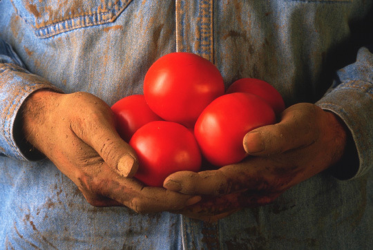

Painting level 0 
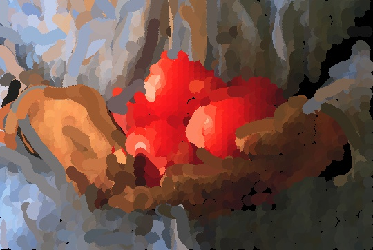

Painting level 1 
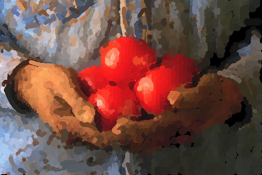

Painting level 2
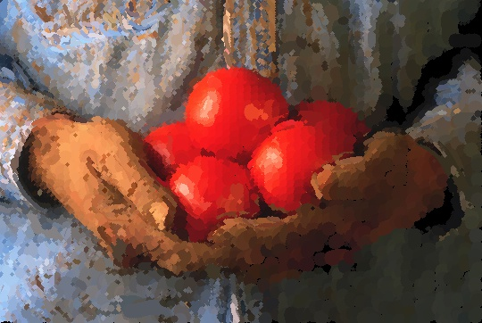

Source Image 

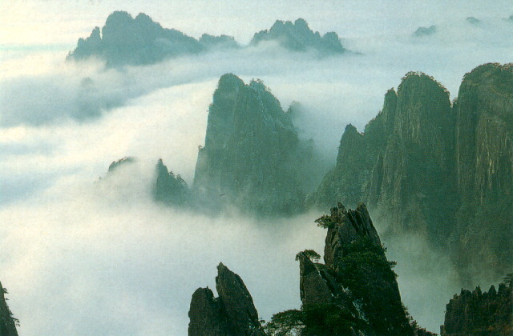

Painting level 0 
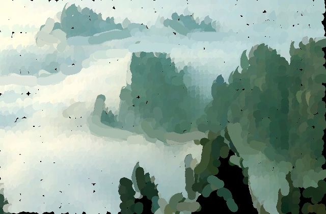

Painting level 1 
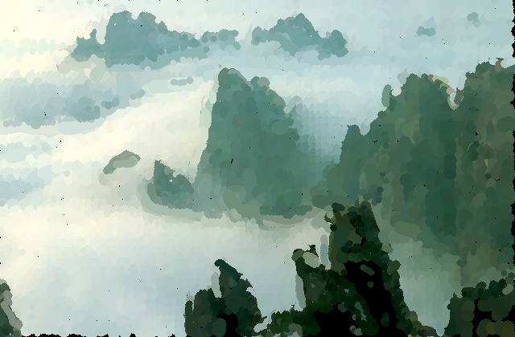

Painting level 2


Source Image 


Painting level 0 
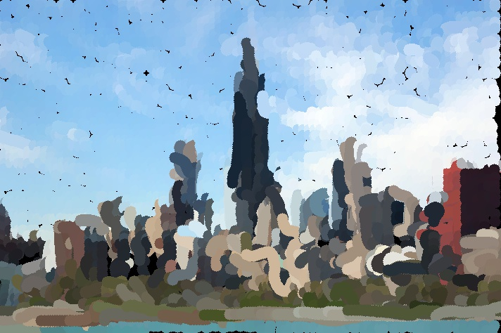

Painting level 1 
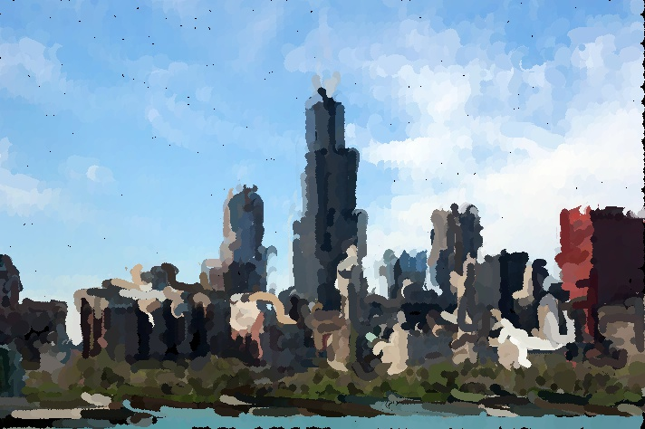

Painting level 2
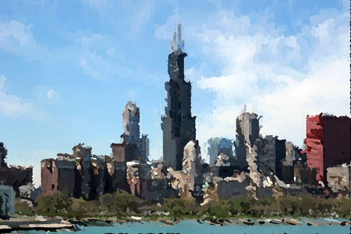

Source Image 

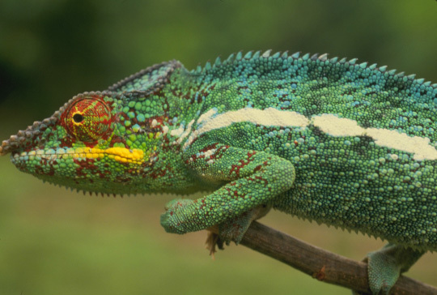

Painting level 0 
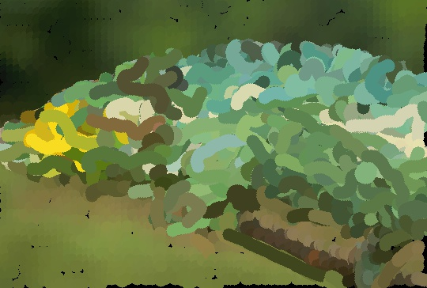

Painting level 1 
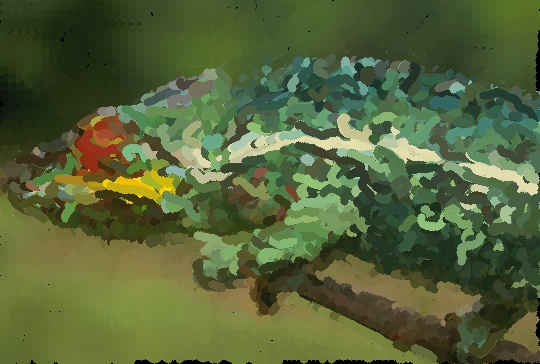

Painting level 2
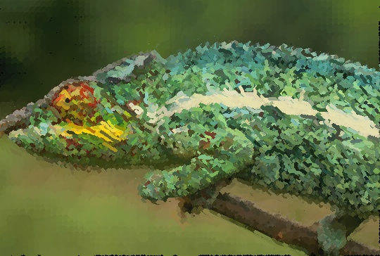